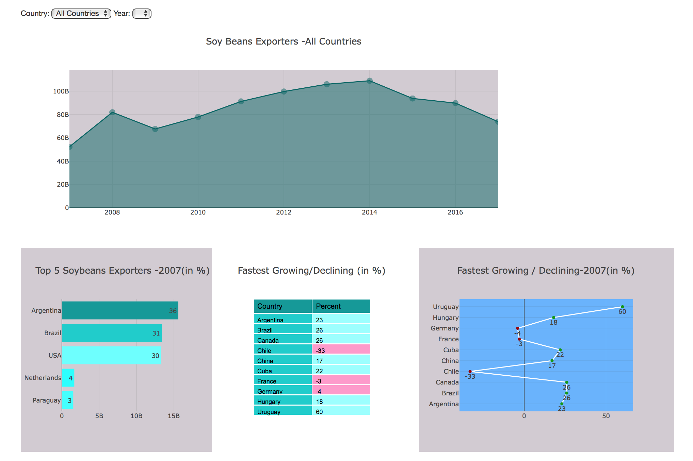
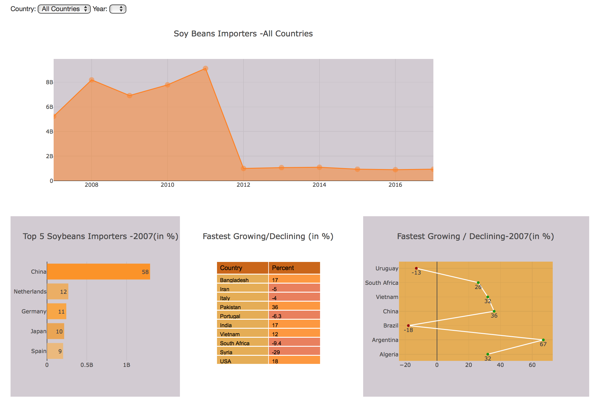
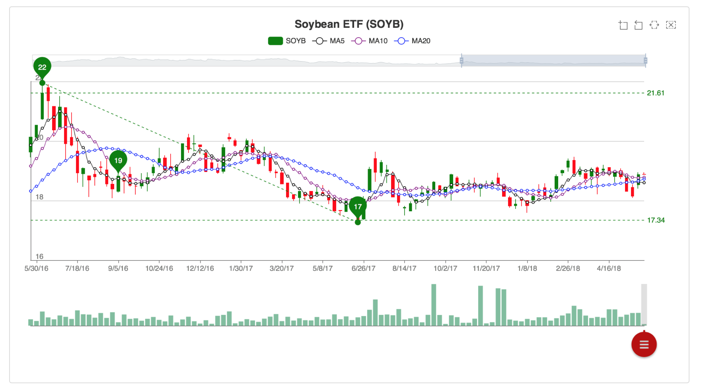

# Title: Soybean Commodity Dashboard
## Objective: Soybean is one of the cruicial part of the global food chain. We want to find out:
- What drives the price of soybeans?
- What major reason you might consider for investing in soybeans?
- What are the top 5 exporters and top 5 importers?

## Implementation:
- Python Flask, HTML/CSS, Javascript
- Database: MongoDB
- Web Scraping, Plotly and dashboard with multiple charts
- New Javascript library: ECharts
- Datasets:
  - Soybean Prices: Investing.com (CSV File) (1963 - 2018)
  - Futures Prices: Investing.com (CSV File) (2011 - 2018)
  - SOYB ETF: Yahoo Finance (CSV File) (2012 - 2018)
  - Import/Export Analysis (2007 - 2016)

## Charts:
1. Top 5 Exporters:

2. Top 5 Importers:

3. Soybean historical prices and Soybean and Corn Futures prices:

4. SOYB ETF:

Checkout the dashboard: https://soybean-commodity.herokuapp.com/
